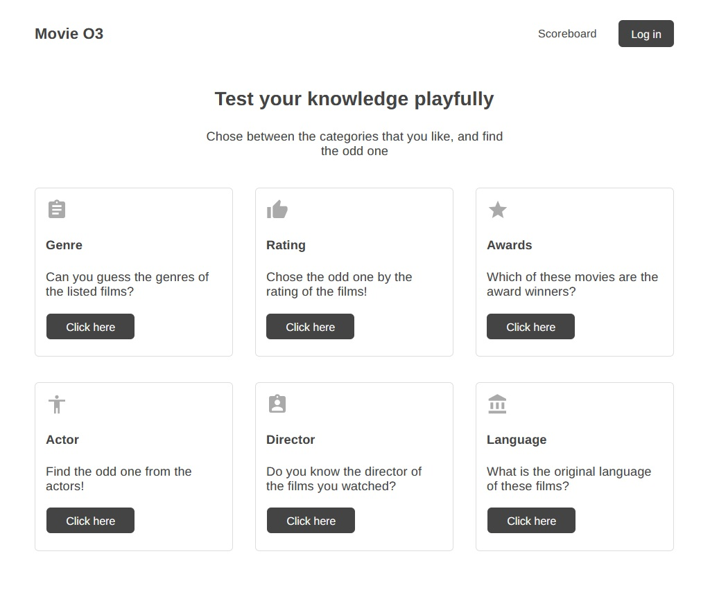
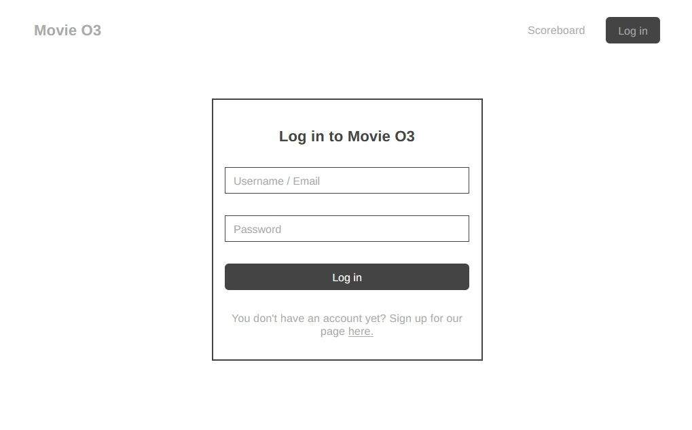
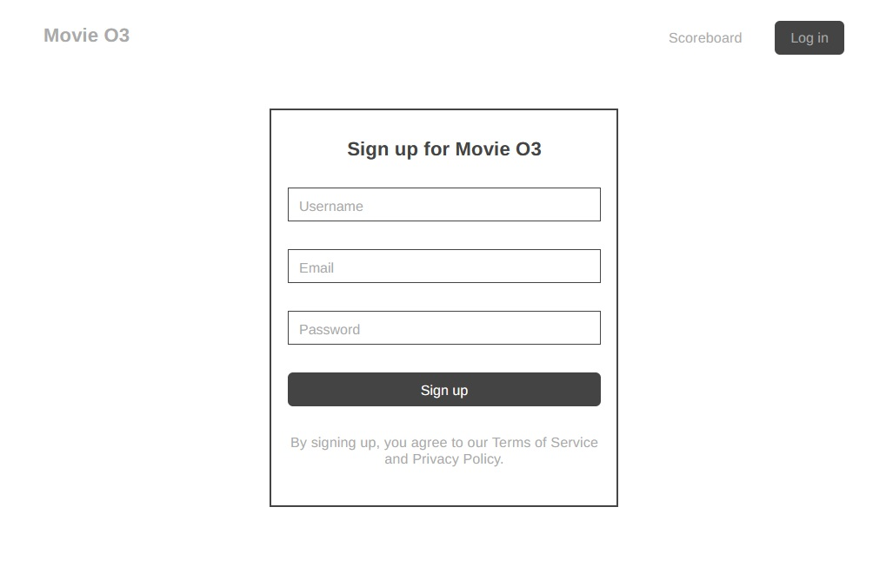
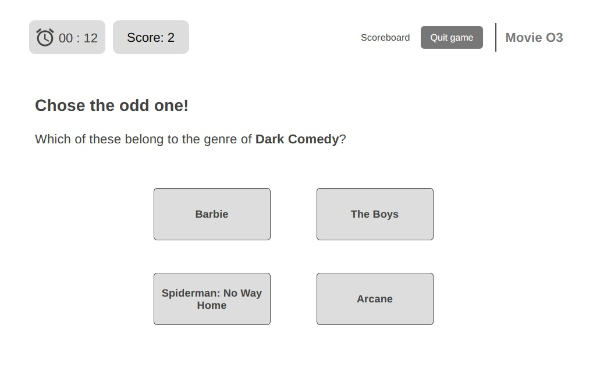
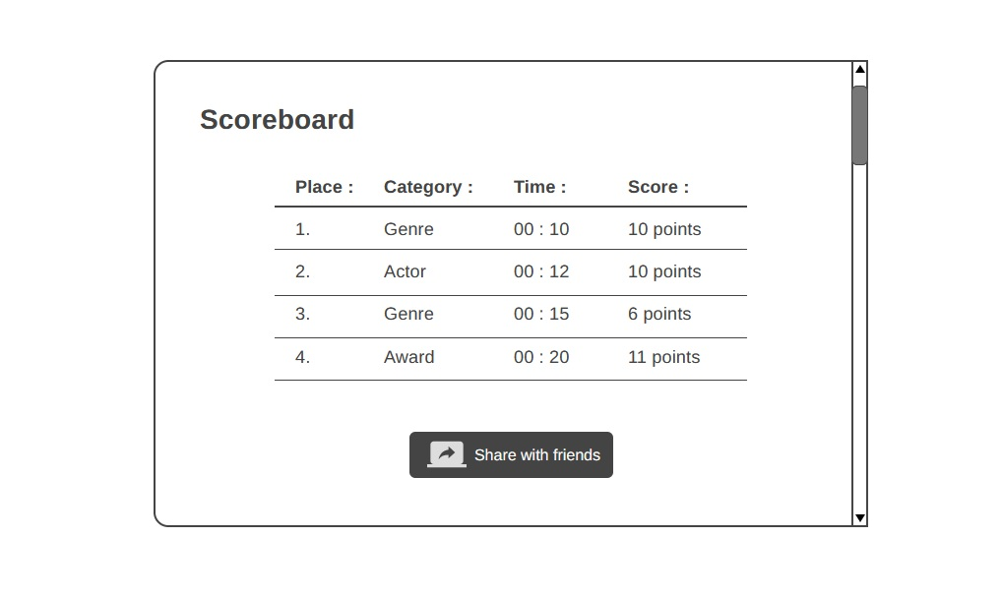
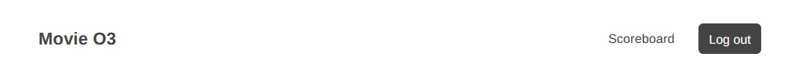

# Funkcionális specifikáció
## [Áttekintés](./kovspec.md)

## [Követelménylista](./kovspec.md#Követelménylista)

## Felülettervek
### Home page
A felhasználó ezen az oldalon tud témákat választani a játék elindításához.

### Log in page
Navigation bar Log in button-re kattintva be tud jelentkezni a fiókjába.

### Sign up page
Ha még nincs fiókja, a Log in page "Sign up here" szövegre kattintva ez az ablak jelenik meg, ahol létre tud hozni egy új fiókot.

### Game page
A téma kiválasztása után erre az oldalra vezeti a felhasználót, ahol maga a játék zajlik le.

### Scoreboard
A játék végén, vagy a 'Scoreboard' button-re kattintva felugrik az ablak amelyen megjelennek a játékos eddigi eredményei.

### Log out navigation bar
Navigation bar-on a Log in button megváltozik Log out button-re ha a felhasználó be van jelentkezve, így ki tud lépni a fiókjából.

