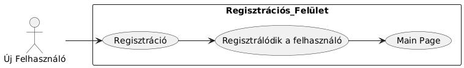
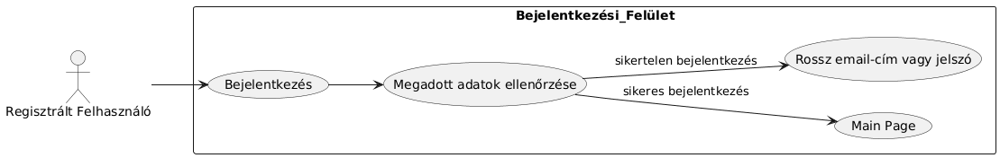
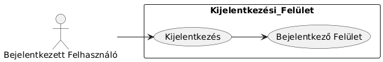
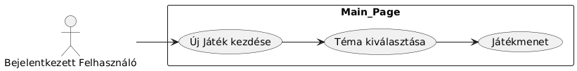
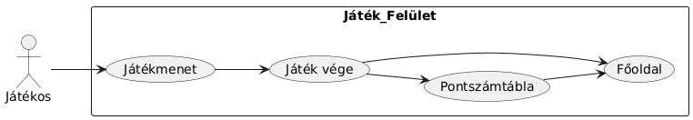
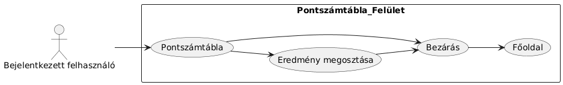

# Rendszerterv

## Fizikai környezet
Fizikai környezet alapján a rendszer bontható két részre.
### Frontend
A felhasználó számára elérhető rendszerfunkciók kezelőfelületét egy weboldal biztosítja, amely a Svelte keretrendszerre épül. A weboldal vizuális megjelenésének kialakításához a Tailwind CSS-t használjuk, a fejlesztéshez pedig a Vite build eszközt vesszük igénybe, mivel ez natívan támogatja a Tailwindet. Fordítás után az elkészült felületet szabványos HTML, CSS és Javascript fájlok alkotják, így bármilyen webszerveren könnyedén elérhetővé válik.
### Backend
A backend a szerveroldali réteg, amelyen keresztül a frontend eléri a szükséges funkciókat. Ez egy Go nyelven fejlesztett REST API, amely a nyelv beépített standard könyvtárának HTTP keretrendszerét használja a funkciók ellátására. Az adattárolást az SQLite adatbázis biztosítja, ami beépített könyvtárként működik, így nincs szükség külön adatbázis-szerver telepítésére és üzemeltetésére. A rendszer külső adatforrásként a TMDb API-t hívja meg, amely a filmek és tv-sorozatok metaadatait szolgáltatja.

## Funkcionális terv

Rendszerszereplők:

- felhasználó

Használati esetek és lefutásaik:

- új felhasználó regisztráció

- regisztrált felhasználó bejelentkezik

- bejelentkezett felhasználó kijelentkezik

- bejelentkezett felhasználó új játékot indít

- játékos játékmenet végére ér

- játékos megnyitja a pontszámtáblát az elért pontszámért

