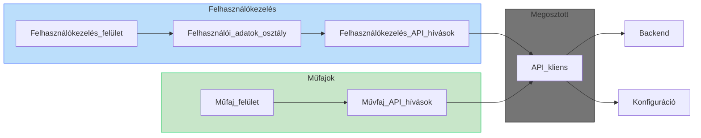
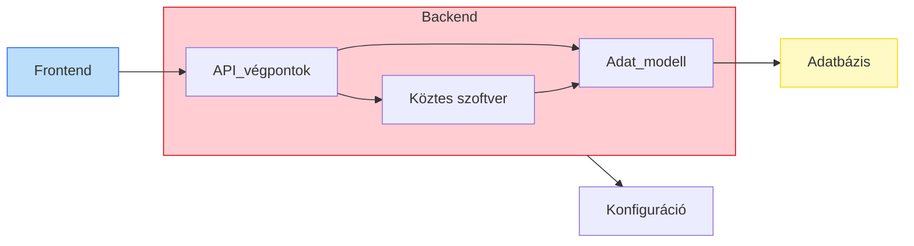
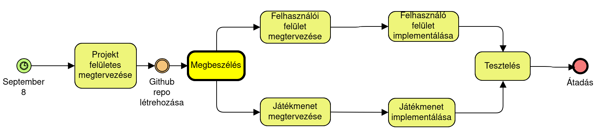
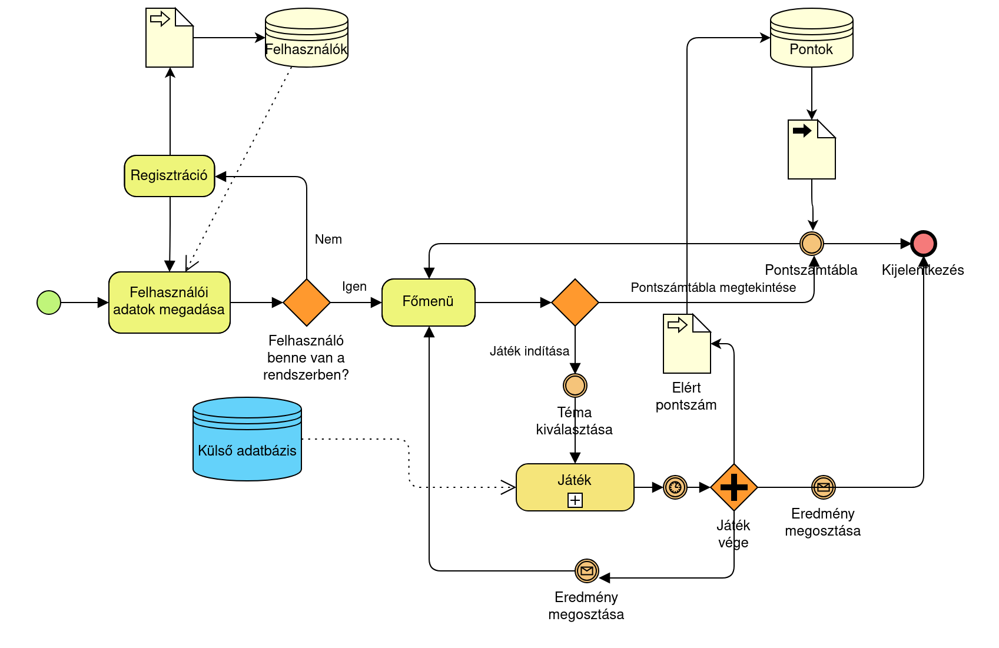

# Rendszerterv

## Projektterv

### Csapattagok
- Ujj Ádám: backend és frontend fejlesztő és tesztelő
- Varga Szabolcs: backend és frontend fejlesztő és tesztelő
- Dobi Fanni: backend és frontend fejlesztő és tesztelő, web designer

### Szerepkörök
- Backend fejlesztő: A szerveroldali logika és az adatkezelés megvalósításáért felel, például adatbázis-tervezés, API-k kialakítása.
- Frontend fejlesztő: A kliensoldali működés és a felhasználói élmény kialakítása, a képernyőtervek implementálása.
- Backend tesztelő: backend oldalon történő műveletek tesztelése.
- Frontend tesztelő: frontend oldalon történő műveletek tesztelése.
- Web designer: A weboldal kinézetének és felhasználói felületének megtervezése.

### Ütemterv és mérföldkövek
#### Sprint 1 – Fejlesztés
- Felhasználókezelés (regisztráció, bejelentkezés, kijelentkezés, személyre szabott adatok tárolása)
- Játék alapstruktúrájának kialakítása: témakörök és kérdések kezelése
- Backend: adatmodell létrehozása a játékhoz (pl. témák, válaszlehetőségek, eredmények tárolása)
#### Sprint 2 – Fejlesztés
- Időzítő és pontszámítás implementálása
- Kakukktojás-kiválasztó mechanika beépítése
- Backend: eredmények és statisztikák kezelése
- Mérföldkő: a játék már működőképes és kipróbálható.
#### Sprint 3 – Fejlesztés
- Felhasználói tesztelésből érkező visszajelzések feldolgozása
- Nehézségi szintek, plusz funkciók (pl. toplista) beépítése
#### Sprint 4 – Tesztelés
- Frontend és backend külön-külön ellenőrzése
- Unit tesztek készítése
#### Sprint 5 – Tesztelés
- A teljes rendszer összehangolt vizsgálata felhasználói szemszögből
- Mérföldkő: a weboldal teljes, használatra kész verziója elkészül

## Fizikai környezet
Fizikai környezet alapján a rendszer bontható két részre.
### Backend
A backend a szerveroldali réteg, amelyen keresztül a frontend eléri a szükséges funkciókat. Ez egy Go nyelven fejlesztett REST API, amely a nyelv beépített standard könyvtárának HTTP keretrendszerét használja a funkciók ellátására. Az adattárolást az SQLite adatbázis biztosítja, ami beépített könyvtárként működik, így nincs szükség külön adatbázis-szerver telepítésére és üzemeltetésére. A rendszer külső adatforrásként a TMDb API-t hívja meg, amely a filmek és tv-sorozatok metaadatait szolgáltatja.
### Frontend
A felhasználó számára elérhető rendszerfunkciók kezelőfelületét egy weboldal biztosítja, amely a Svelte keretrendszerre épül. A weboldal vizuális megjelenésének kialakításához a Tailwind CSS-t használjuk, a fejlesztéshez pedig a Vite build eszközt vesszük igénybe, mivel ez natívan támogatja a Tailwindet. Fordítás után az elkészült felületet szabványos HTML, CSS és Javascript fájlok alkotják, így bármilyen webszerveren könnyedén elérhetővé válik.

## Funkcionális terv

Rendszerszereplők:

- felhasználó

Használati esetek és lefutásaik:

- új felhasználó regisztráció

- regisztrált felhasználó bejelentkezik

- bejelentkezett felhasználó kijelentkezik

- bejelentkezett felhasználó új játékot indít

- játékos játékmenet végére ér

- játékos megnyitja a pontszámtáblát az elért pontszámért

## Architekturális terv
### Frontend
A frontend egy Svelte alapú webalkalmazás.

Az alábbi fő komponensekből épül fel:
- Felhasználókezelés: Magában foglalja a regisztrációs és bejelentkezési oldalakat, a felhasználói adatok kezeléséért felelős osztályt, valamint a felhasználói műveletekhez kapcsolódó backend-hívásokat.
- Műfajok: Ide tartozik a műfajválasztó táblázat és ablak, továbbá az ezek működését biztosító backend-kommunikációs függvények.
- Megosztott: Olyan függvények és osztályok gyűjtőhelye, amelyeket a rendszer több része is használ, például a backend-kapcsolatot kezelő modul.
- Konfiguráció: A webalkalmazás frontend beállításait tartalmazó fájl, ahol többek között a backend szerver elérési útja van meghatározva.

### Backend
A backend egy Go nyelven fejlesztett REST API, amely a felhasználók adatait és az általuk mentett műveket kezeli. Az információk egy SQLite adatbázisban kerülnek tárolásra.

Az architektúra fő elemei a következők:
- API végpontok: A különféle funkciókhoz tartozó útvonalak, például regisztráció, bejelentkezés, pontszámtábla.
- Köztes Szoftver: Az autentikációt és jogosultságkezelést ellátó köztes réteg, amely biztosítja, hogy a védett végpontokat csak hitelesített felhasználók érhessék el.
- Adat modell: Az adatbázis táblák és kapcsolatok leírása, illetve a rajtuk végzett műveletek megvalósítása.
- Konfiguráció: A backend beállításokat tartalmazó fájl, például az adatbázis elérési útja, külső API-k kulcs és egyéb paraméterek.
- Adatbázis: Az SQLite rendszer, amelyben a felhasználói adatok tárolódnak.

## Adatbázis terv

Az adatbázisban a **User** táblában tároljuk a regisztrációkor megadott adatokat, a **Scores** táblában pedig az általuk elért pontszámokat.
**Users**:
 - id: int, elsődleges kulcs
 - username: felhasználónév, string, unique megszorítással
 - email: email cím, string
 - password\_hashed: hash-elt jelszó, string

 **Scores**
  - id: int, elsődleges kulcs
  - user\_id: int, külső kulcs
  - category: kategória, amiben el lett érve az eredmény, string
  - score: elért eredmény, int
  - time: teljesítés ideje, time (mm:ss)

## Üzleti folyamatok modellje

### Megvalósítás folyamatának modellje

### Szolgáltatás folyamatának modellje

## Tesztterv
### Frontend tesztterv

Cél: A frontend működésének ellenőrzése.

A kezdőoldalon a látogató számára meg kell jelenjen a regisztráció vagy bejelentkezés lehetősége. Sikeres belépés után a főképernyőn különböző témakörökből választhat, majd elindíthatja a játékot. A játék során ki tudja jelölni a kakukktojást, miközben az időzítő méri az időt, és pontokat gyűjthet. A játszma végén az eredménytáblán (Scoreboard) láthatóvá kell váljanak az elért pontok, és biztosítva kell lennie a kijelentkezésnek is.

#### Tesztelési típusok:
- Unit és end-to-end tesztek:
  - Ellenőrizni kell, hogy a Scoreboard pontos adatokat jelenít meg.
  - A kakukktojás helyes vagy hibás kiválasztása megfelelő következményekkel járjon.
  - A frontend komponensek (gombok, oldalak) helyesen működjenek és jól jelenjenek meg.
  - Az oldalak közötti navigáció zökkenőmentes legyen.
  - A frontend metódusok (pl. időzítő, pontszámítás) megfelelően fussanak le.
- Alfa teszt:
  - A fejlesztők saját kezűleg, felhasználói szemszögből vizsgálják a rendszert.
  - Cél a hibák, vizuális eltérések vagy használhatósági problémák feltárása.
  - Ez a tesztelés a fejlesztési szakaszban és a kész verziónál is zajlik.

### Backend tesztterv

Cél: A szerveroldali működés, az adatkezelés és az API-k megbízhatóságának vizsgálata.

A backend feladata többek között a felhasználói hitelesítés, a játék eredmények tárolása és megosztása, valamint a hibás kérések megfelelő kezelése. Az API-knak helyesen kell működniük, a felhasználók gond nélkül tudjanak regisztrálni, belépni, játszani, és a Scoreboard helyes adatokat mutasson.

#### Tesztelési típusok:
- Unit teszt:
  - Cél: Részletes ellenőrzés a fejlesztés során, API végpontok és az adatkezelési logika helyességéről.
  - Tesztelendő területek:
    - Felhasználói hitelesítés: regisztráció és bejelentkezés tesztelése helyes és hibás adatokkal.
    - Eredménykezelés: a Scoreboard frissülése a játszmák végén.
    - Adatok hitelessége: biztosítani kell, hogy a tárolt pontszámok és statisztikák mindig pontosak legyenek.
  - Módszer: Pozitív és negatív tesztesetek lefuttatása, különböző adatbázis-állapotok vizsgálata, minden végponthoz külön ellenőrző esetek készítése.
- Alfa teszt:
  - Cél: A rendszer egészének kipróbálása a felhasználó szemszögéből.
  - Tesztelendő területek:
    - Felhasználói funkciók: regisztráció, belépés, játék indítása, kakukktojás választás, eredmények megtekintése.
    - Adatkezelés: a felhasználói műveletek pontos hatásainak ellenőrzése az adatbázisban.
    - Hibakezelés: a rendszer adjon megfelelő visszajelzést hibás bevitelnél vagy rossz kéréseknél.
  - Módszer: Manuális tesztelés valós felhasználói szituációk szimulálásával, hibás adatok és rendellenes helyzetek kipróbálásával.
